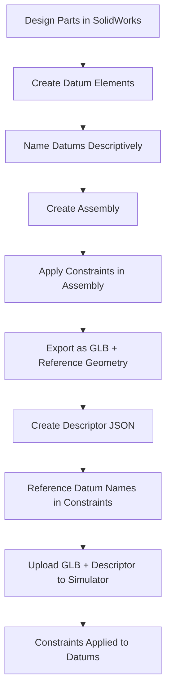

# Datum-Based Constraints Quick Reference

## Overview

The gripper simulator supports **precise sub-element constraints** using SolidWorks datum planes, points, and axes. This hybrid approach keeps the current node-based system while enabling constraint enforcement at specific edges, faces, and points.

---

## How It Works

```
SolidWorks Assembly → GLB Export → Simulator
     ↓                    ↓              ↓
Datum Elements      Named Nodes    Constraint Targets
(planes/points)     (in GLB)       (in descriptor)
```

**Key Concept:** Datum elements created in SolidWorks export as **separate named nodes** in the GLB file, which can then be referenced in constraint definitions.

---

## Quick Start

### 1. In SolidWorks

**Create datum elements:**
- **Planes:** `Insert → Reference Geometry → Plane`
- **Points:** `Insert → Reference Geometry → Point`
- **Axes:** `Insert → Reference Geometry → Axis`

**Name them descriptively:**
- Right-click in FeatureManager tree → Rename
- Use underscores: `jaw_left_pivot_point`
- Avoid spaces and special characters

**Export assembly:**
- `File → Save As → GLTF Binary (*.glb)`
- Click "Options" → Enable "Include Reference Geometry"
- Save

### 2. In Descriptor

**Reference datum names in constraints:**

```json
{
  "constraints": [
    {
      "id": "parallel_surfaces",
      "type": "Parallel",
      "entities": [
        "jaw_left_grip_plane",
        "jaw_right_grip_plane"
      ],
      "weight": 1.0
    },
    {
      "id": "concentric_pivots",
      "type": "Concentric",
      "entities": [
        "jaw_left_pivot_point",
        "jaw_right_pivot_point"
      ],
      "weight": 1.0
    }
  ]
}
```

---

## Common Patterns

### Pattern 1: Parallel Gripping Surfaces

**Goal:** Keep inside jaw surfaces parallel

**SolidWorks:**
1. Create datum plane on left jaw inner face: `jaw_left_grip_plane`
2. Create datum plane on right jaw inner face: `jaw_right_grip_plane`

**Constraint:**
```json
{
  "type": "Parallel",
  "entities": ["jaw_left_grip_plane", "jaw_right_grip_plane"],
  "weight": 1.0
}
```

### Pattern 2: Aligned Pivot Points

**Goal:** Ensure rotation centers align

**SolidWorks:**
1. Create datum point at left pivot center: `jaw_left_pivot_point`
2. Create datum point at right pivot center: `jaw_right_pivot_point`

**Constraint:**
```json
{
  "type": "Concentric",
  "entities": ["jaw_left_pivot_point", "jaw_right_pivot_point"],
  "weight": 1.0
}
```

### Pattern 3: Collinear Rotation Axes

**Goal:** Multiple joints rotate about same axis

**SolidWorks:**
1. Create datum axis through left shaft: `jaw_left_rotation_axis`
2. Create datum axis through right shaft: `jaw_right_rotation_axis`

**Constraint:**
```json
{
  "type": "Collinear",
  "entities": ["jaw_left_rotation_axis", "jaw_right_rotation_axis"],
  "weight": 1.0
}
```

### Pattern 4: Horizontal Base

**Goal:** Keep platform level

**SolidWorks:**
1. Create datum plane on base top: `base_reference_plane`

**Constraint:**
```json
{
  "type": "Horizontal",
  "entities": ["base_reference_plane"],
  "weight": 0.7
}
```

### Pattern 5: Perpendicular Linkage

**Goal:** Linkage perpendicular to base

**SolidWorks:**
1. Create datum axis along linkage: `linkage_axis`
2. Create datum plane on base: `base_reference_plane`

**Constraint:**
```json
{
  "type": "Perpendicular",
  "entities": ["linkage_axis", "base_reference_plane"],
  "weight": 0.8
}
```

---

## Constraint Type Compatibility

| Constraint | Works With | Example Datums |
|------------|------------|----------------|
| **Parallel** | Planes, Axes | `jaw_left_plane`, `jaw_right_plane` |
| **Perpendicular** | Planes, Axes | `linkage_axis`, `base_plane` |
| **Collinear** | Points, Axes | `pivot_axis_1`, `pivot_axis_2` |
| **Concentric** | Points | `pivot_point_left`, `pivot_point_right` |
| **Coincident** | Points | `contact_point_1`, `contact_point_2` |
| **Horizontal** | Planes | `base_reference_plane` |
| **Vertical** | Planes, Axes | `symmetry_plane`, `vertical_axis` |
| **Tangent** | Planes | `surface_plane_1`, `surface_plane_2` |

---

## Naming Best Practices

### ✅ Good Names

```
jaw_left_pivot_point
jaw_right_grip_plane
base_reference_plane
linkage_center_axis
assembly_symmetry_plane
contact_point_left
rotation_axis_1
```

### ❌ Bad Names

```
Plane1                  (not descriptive)
jaw left pivot          (has spaces)
jaw@pivot!              (special characters)
Jaw_Left_Pivot_Point    (mixed case - inconsistent)
```

### Recommended Pattern

```
[part_name]_[descriptor]_[element_type]

Examples:
- jaw_left_pivot_point
- jaw_left_grip_plane
- base_reference_plane
- assembly_symmetry_plane
```

---

## Export Checklist

Before exporting GLB from SolidWorks:

- [ ] All datum elements created
- [ ] All datums renamed with descriptive names
- [ ] Names use underscores (no spaces)
- [ ] Datums visible in FeatureManager tree
- [ ] Export options set:
  - [ ] "Include Reference Geometry" enabled
  - [ ] "Export all objects" enabled
  - [ ] "DRACO compression" optional (simulator supports both)

---

## Verification Steps

After exporting GLB:

1. **Check node names:**
   - Upload GLB to simulator
   - Open browser console
   - Look for: `[Gripper] Found node: jaw_left_pivot_point`
   - Verify all datum names appear

2. **Online GLB viewer:**
   - Visit: https://gltf-viewer.donmccurdy.com/
   - Upload your GLB file
   - Expand node tree on left
   - Check datum elements present

3. **Test constraints:**
   - Create descriptor with datum-based constraints
   - Upload both GLB and descriptor
   - Verify constraints work
   - Check console for warnings

---

## Troubleshooting

### Datum not found in GLB

**Causes:**
- Export options didn't include reference geometry
- Datum hidden/suppressed in SolidWorks
- Name changed during export

**Solutions:**
- Re-export with "Include Reference Geometry" enabled
- Check datum visibility in SolidWorks
- Use GLB viewer to check actual exported names

### Constraint not working

**Causes:**
- Name mismatch between GLB and descriptor
- Datum inside part hierarchy (nested node)
- Wrong constraint type for datum element type

**Solutions:**
- Verify exact name match (case-sensitive)
- Check browser console for "Entity not found" warnings
- Use appropriate constraint for element type (see compatibility table)

### Too many nodes in scene

**Causes:**
- Exported unnecessary construction geometry
- All reference geometry exported (not just named datums)

**Solutions:**
- Hide/suppress unwanted geometry before export
- Use assembly configurations to control visibility
- Only create and name datums needed for constraints

---

## No Code Changes Needed!

The simulator **already supports** datum-based constraints:

✅ Node names in descriptor map to nodes in GLB  
✅ Datum elements export as nodes from SolidWorks  
✅ Constraints work on any named node (part or datum)  
✅ All 9 constraint types support datum elements  

**Just follow the SolidWorks workflow and use descriptive datum names!**

---

## Complete Documentation

- **[SOLIDWORKS_DATUM_TUTORIAL.md](./SOLIDWORKS_DATUM_TUTORIAL.md)** - Full step-by-step tutorial (11 sections)
- **[ITERATIVE_SOLVER_GUIDE.md](./ITERATIVE_SOLVER_GUIDE.md)** - Constraint solver documentation
- **[example_descriptor_with_datums.json](./example_descriptor_with_datums.json)** - Working example
- **[DRACO_SUPPORT.md](./DRACO_SUPPORT.md)** - DRACO compression guide

---

## Example Workflow



---

**The hybrid approach combines the simplicity of node-based constraints with the precision of SolidWorks datum reference geometry!** 🎯
